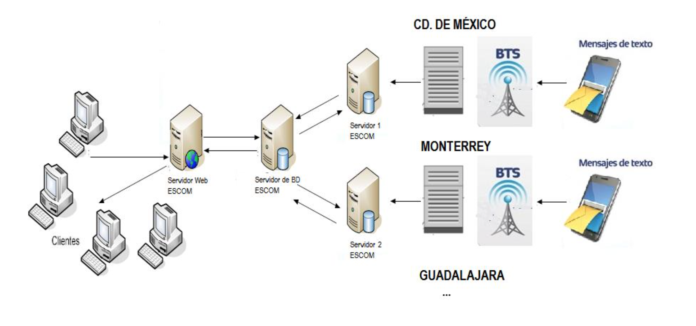
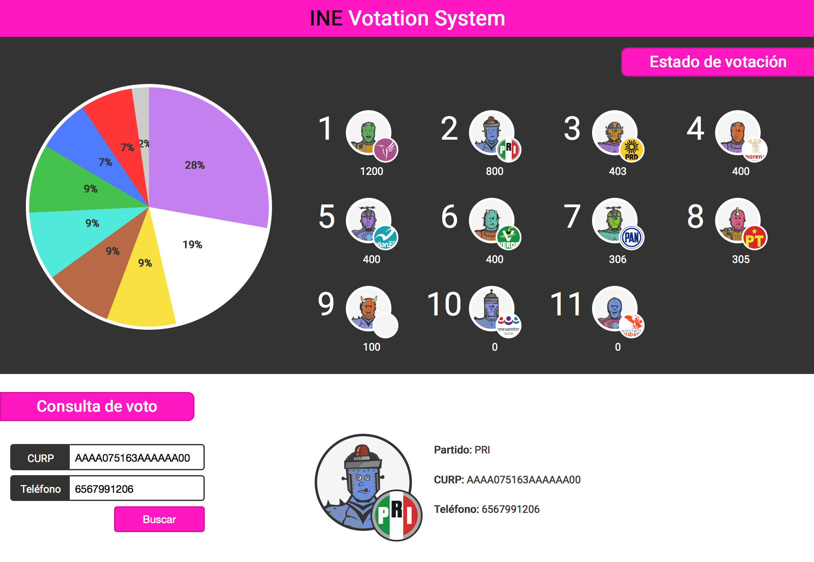

# INE-Votation-Distributed-System
This is distrubuted system project simulating a SMS distributed solution for Mexico INE votation using C++ UDP Sockets and SQLite


## Distribution



## Web Server

Server that listens UDP request from votation and sends updates to **web clients** through [socket.io](http://socket.io/).

### Prerequisites

- [Git](https://git-scm.com/)
- [Node.js](https://nodejs.org/) (with NPM)

### Installation

- `git clone <repository-url>` this repository
- change into the new directory
- `cd web-server`
- `npm install`

### Configuration

- open `config.json` file
- update `udp`, `http` and `express` default server settings


```
{
	"udp": {
		"host": "0.0.0.0",
		"port": 7777
	},
	"http": {
		"host": "0.0.0.0",
		"port": 8080
	},
	"express": {
		"host": "0.0.0.0",
		"port": 8081
	}
}
```


### Running

- ``node server``
- Visit app at [http://localhost:8080](http://localhost:8080)


## Web Client

Client that listens **web server** updates from votation through [socket.io](http://socket.io/).

### Prerequisites

- [Git](https://git-scm.com/)
- [Node.js](https://nodejs.org/) (with NPM)
		

### Installation

- `git clone <repository-url>` this repository
- change into the new directory
- `cd web-client`
- `npm install node-static`

### Configuration

- open `index.js` file
- modify app `socket` and `http` configuration vars

```
{
	...
	socketURL : 'http://localhost:8080',
	httpURL : 'http://localhost:8081',
	...
}
```

### Running

- ``static -a 0.0.0.0 -p 8082``
- Visit app at [http://localhost:8082](http://localhost:8082)

### Preview



